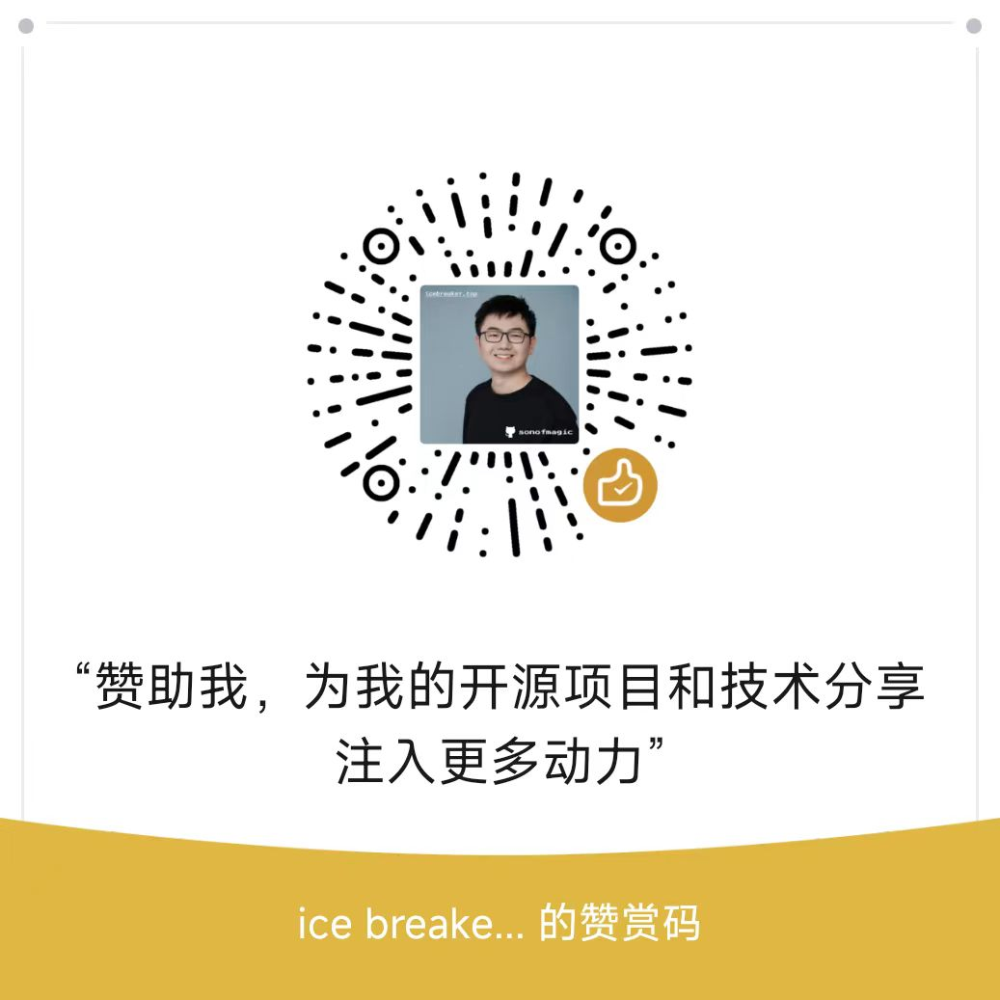

# Support icebreaker's open-source work

English | [简体中文](./README.md)

Thank you for supporting [icebreaker (@sonofmagic)](https://github.com/sonofmagic). Your contribution funds project maintenance, bug fixes, documentation, and practical engineering content.

There are two independent ways to participate: permanent recognition for individual sponsors and fixed-term documentation sidebar advertising for businesses.

## Individual sponsorship

### Sponsorship tiers

| Tier | Amount | Permanent benefit |
| --- | ---: | --- |
| Standard support | CNY 20 | A public thank-you record |
| Bronze sponsorship | CNY 200 | GitHub avatar, username, and profile link |
| Silver sponsorship | CNY 1,000 | Bronze benefits plus placement in the featured sponsor list |
| Custom amount | Enter any amount | The highest individual tier covered by cumulative verified payments |

Individual recognition is public by default and does not expire. You can explicitly opt out in the verification form. Custom contributions are matched against cumulative verified payments from the same GitHub account: CNY 20, 200, and 1,000 unlock Standard, Bronze, and Silver respectively. Totals below CNY 20 are still appreciated but do not enter a public tier.

### Payment methods

| WeChat Pay | Alipay |
| :---: | :---: |
|  |  |

After payment, open an [English individual sponsorship verification issue](https://github.com/sonofmagic/sponsors/issues/new?template=personal-sponsorship-en.yml). Only the sponsorship tier is required. The issue author is used as the GitHub identity by default, and the issue creation time is used when payment time is omitted.

## Business sponsorship and advertising

The following introductory prices apply during the initial trial. Ads appear only in the right sidebar of desktop documentation pages; mobile, homepage, and other-page impressions are not included.

| Package | Introductory price | Advertising benefit |
| --- | ---: | --- |
| Single-site monthly ad | CNY 2,000 | Exclusive desktop documentation sidebar placement on either `weapp-tailwindcss` or `weapp-vite` for 30 calendar days |
| Two-site monthly ad | CNY 3,000 | Exclusive desktop documentation sidebar placement on both sites for 30 calendar days |
| Two-site quarterly partner | CNY 8,000 | Exclusive desktop documentation sidebar placement on both sites for 90 calendar days |
| Custom partnership | Contact us | A custom schedule, placement, or project collaboration |

Every business package includes permanent Silver recognition. After the ad period ends, the company name, logo, and target link remain in the featured sponsor list.

### Application and publishing process

1. Open an [English business advertising application](https://github.com/sonofmagic/sponsors/issues/new?template=business-sponsorship-en.yml) with the package, brand name, target link, ad copy, alternative text, and logo asset.
2. The maintainer reviews the content, assets, and available schedule, then confirms the final launch date.
3. Pay only after both parties confirm the campaign. Do not use the individual sponsorship QR codes to prepay advertising fees.
4. The 30- or 90-calendar-day period begins when the approved assets are deployed and live.

Each site carries at most one paid campaign at a time. If site outages exceed 24 cumulative hours during a campaign, the affected time will be added to the schedule. Packages do not guarantee clicks, conversions, homepage impressions, or mobile impressions.

### Asset and review policy

- Logos may be SVG, transparent PNG, or WebP, with a maximum size of 1 MB per file;
- A brand name, target URL, alternative text, and short advertising message are required;
- Chinese copy should preferably stay within 30 Chinese characters, and English copy within 60 characters;
- Ads must be legal and relevant to developers, cloud services, engineering tools, or the open-source ecosystem;
- Gambling, illicit industries, infringement, misleading claims, and competitor impersonation are rejected;
- The maintainer retains final approval over content, assets, links, scheduling, and presentation.

Reliable public traffic data for the documentation sites is not yet available, so these are introductory trial prices. Pricing will be reviewed after 90 days or 3 paid campaigns using site traffic, click data, sell-through rate, and sponsor feedback. Later price changes will not affect confirmed orders.

## Privacy and verification

GitHub issues are public. Do not post a complete transaction ID, payment receipt, phone number, email address, or other sensitive information. The maintainer will arrange a private follow-up if an individual payment needs further verification. Business advertising must be paid only after the schedule and assets have been approved.

## FAQ

### Can an individual sponsor remain anonymous?

Yes. Select no public recognition in the individual verification form. You may also skip the issue, although the payment may then be difficult to verify or count toward a cumulative tier.

### Does individual sponsor recognition expire?

No. Verified individual benefits remain permanently unless the sponsor asks for removal or the displayed content violates project policy.

### Why should a business not pay immediately?

Advertising requires content review, usable assets, and a conflict-free schedule. Approval before payment avoids refund disputes when a requested slot or submitted asset cannot be used.

### What remains after an ad expires?

The sidebar ad is removed on schedule. The company name, logo, and link remain permanently in the sponsor list under Silver recognition.

## Thank you

Every contribution gives me more time to maintain open-source software. Thank you for your trust and support.
