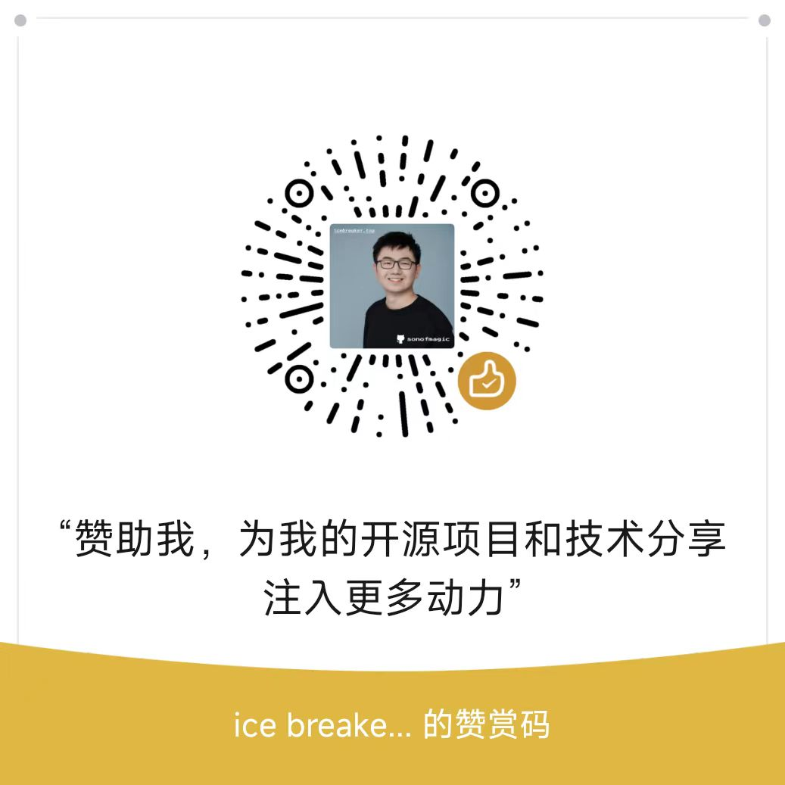

# sponsors

icebreaker's sponsors，赞助我，让我生产更多优质的开源项目和技术文章。

- [sponsors](#sponsors)
  - [您将获得什么？](#您将获得什么)
  - [微信赞助](#微信赞助)
  - [支付宝赞助](#支付宝赞助)
  - [赞助完成后(重要!)](#赞助完成后重要)

## 您将获得什么？

1. 我的 github 中有影响的 repo ，展示你的 github 头像。(可选)
2. 我的 icebreaker.top 和其他网站/项目中，展示你的 github 信息。(可选)
3. 金额较大者，可以提供技术咨询和方案设计的服务

## 微信赞助

<!--  -->

## 支付宝赞助

<!--  -->

## 赞助完成后(重要!)

请在这个仓库里面提一个 `issue`, 便于我进行金额的校对与收集信息。
